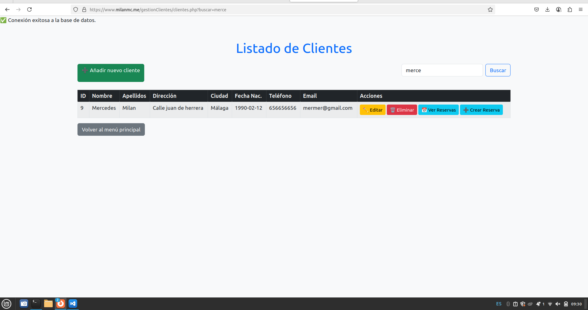

# Gestión de Clientes y Reservas

## Dominio usado

La aplicación está desplegada en el dominio: 
**https://milanmc.me/gestionClientes**

Que tiene los siguientes archivos: 
clientes.php  conexion.php  crear_cliente.php  crear_reserva.php  editar_cliente.php  editar_reserva.php  eliminar_cliente.php  eliminar_reserva.php  index.php  reservas.php  todasLasReservas.php

---

## Explicación proyecto

## 1. Estructura del proyecto

El proyecto se encuentra en la ruta:
```
/var/www/milanmc.me/gestionClientes
```
Incluye los siguientes archivos principales:
- `index.php`: Landing page con acceso a Clientes y Reservas
- `clientes.php`: Listado y gestión de clientes
- `reservas.php`: Listado y gestión de reservas asociadas a cada cliente
- `todasLasReservas.php`: Listado de todas las reservas
- CRUD de clientes: `crear_cliente.php`, `editar_cliente.php`, `eliminar_cliente.php`
- CRUD de reservas: `crear_reserva.php`, `editar_reserva.php`, `eliminar_reserva.php`
- `conexion.php`: Conexión a la base de datos mediante PDO

---

## 2. Creación de la base de datos y usuario

### Script usado

```sql
CREATE DATABASE gestion_clientes;

USE gestion_clientes;

CREATE TABLE clientes (
    id INT AUTO_INCREMENT PRIMARY KEY,
    nombre VARCHAR(100),
    apellidos VARCHAR(100),
    direccion VARCHAR(255),
    ciudad VARCHAR(100),
    fecha_nacimiento DATE,
    telefono VARCHAR(20),
    email VARCHAR(100)
);

CREATE TABLE reservas (
    id INT AUTO_INCREMENT PRIMARY KEY,
    id_cliente INT,
    fecha_inicio DATE,
    fecha_fin DATE,
    precio DECIMAL(10,2),
    observaciones TEXT,
    FOREIGN KEY (id_cliente) REFERENCES clientes(id) ON DELETE CASCADE
);
```

### Creación de usuario y permisos

```sql
CREATE USER 'gestioncliente'@'localhost' IDENTIFIED BY '12341234';
GRANT ALL PRIVILEGES ON gestion_clientes.* TO 'gestioncliente'@'localhost';
FLUSH PRIVILEGES;
```

---

## 3. Configuración de la conexión en PHP

El archivo `conexion.php` utiliza PDO para una conexión segura y eficiente a MySQL:

```php
<?php
$host = 'localhost';
$db = 'gestion_clientes';
$user = 'gestioncliente';
$pass = '12341234';

try {
    $pdo = new PDO("mysql:host=$host;dbname=$db;charset=utf8", $user, $pass);
    $pdo->setAttribute(PDO::ATTR_ERRMODE, PDO::ERRMODE_EXCEPTION);
    echo "Conexión exitosa a la base de datos.";
} catch (PDOException $e) {
    die("Error en la conexión: " . $e->getMessage());
}
?>
```
> **Nota:** En este caso he dejado el `echo` para comprobar que todo iba correctamente.
---

## 4. Estructura y funcionamiento de la aplicación

  **Creación base de datos:** 
  Creación de la base de datos y script
  - 

- **Dominio** 
  Página principal de milanmc.me en la cual escogemos ver el proyecto Gestión de clientes
  - 

- **Conexion (conexion.php):** 
  Contenido Conexion
  - 
 
- **Gestión de Clientes y Reservas (index.php):** 
  Página principal del proyecto para acceder a Clientes o Reservas
  - 

- **Gestión de Clientes (clientes.php):** 
  Listado de clientes con opciones para crear, editar, eliminar y buscar clientes. 
  - 

- **Añadir nuevo cliente (crear_cliente.php):** 
  Botón en la sección de clientes para agregar uno nuevo. 
  - 

- **Gestión de Reservas (reservas.php/todasLasReservas.php):** 
  Listado de reservas, posibilidad de crear, editar o eliminar reservas asociadas a clientes. 
  - 

- **Búsqueda:** 
  Permite buscar clientes por nombre o apellidos y reservas. 
   - 
 
-  **Crear reservas para un cliente (crear_reserva.php):** 
  Desde la lista de clientes se crea una nueva reserva en "crear reserva". 
  - 

- **Ver reservas de un cliente (reservas.php):** 
  Desde la lista de clientes se puede acceder a las reservas de ese cliente. 
  - 

- **CRUD completo:** 
  La aplicación permite crear, leer, actualizar y eliminar tanto clientes como reservas de manera sencilla y visual, usando formularios PHP conectados a la base de datos mediante PDO.

---
